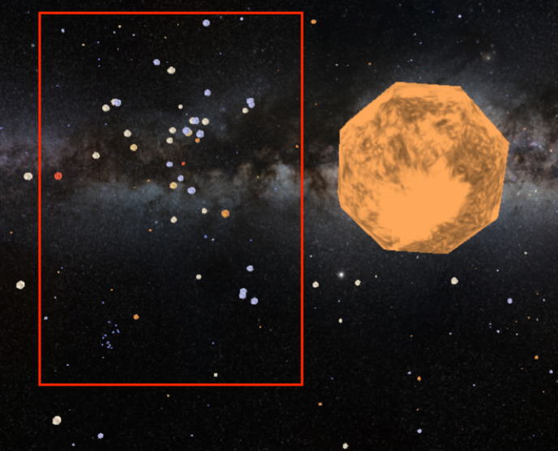
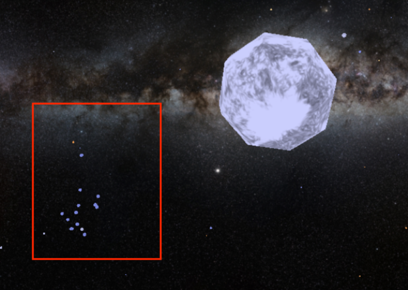
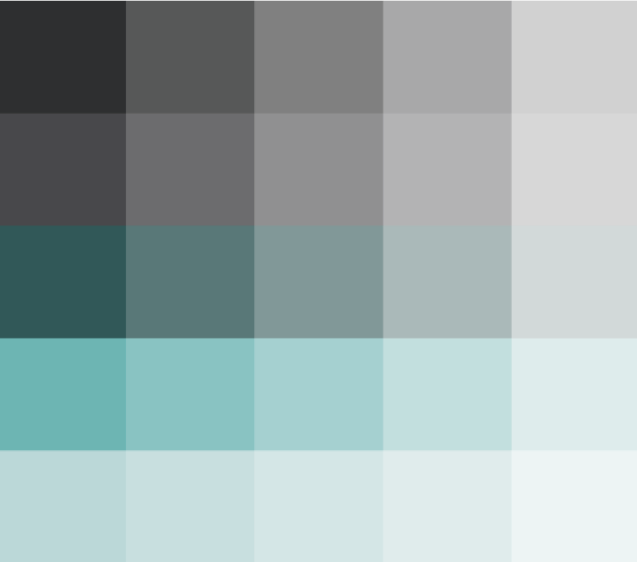
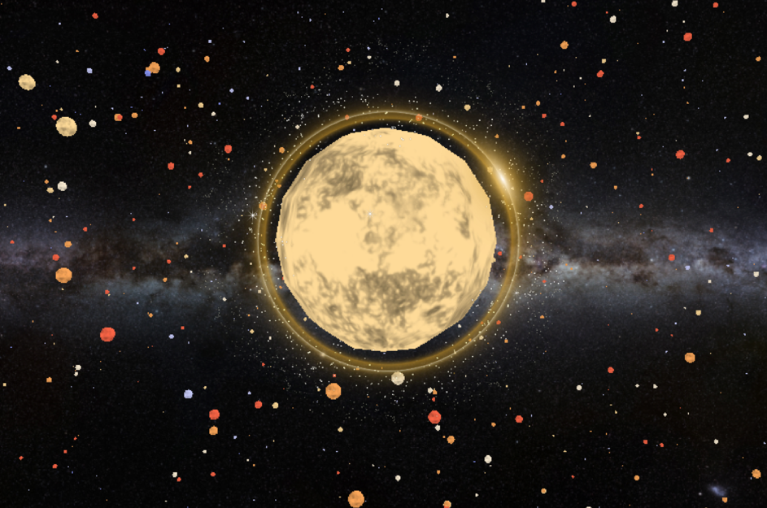

# IvisPro_StellarMap

by Benjamin Huber & Julia Müller

### Install server for the application

Install a server with following command in the terminal:

\$ http-server [path with the working-directory]

Than select one given url and open folder 'source' --> the application with the html page will be shown.

## Story of our information visualization project

### Intro

"If you look up into the sky during a clear night, you will find it covered with stars. But what
kind of stars are there? How far away are they exactly and which ones are the closest? Is
the brightest star in the sky really the most luminous one?" All the answer you can find in our Stellarmap.

### Stellarmap control:

- To rotate in any direction you can hold down and move the mouse.
- For zooming in and out you can move the mousewheel
- To get information about other stars you can select any star with one click. Information in the box will be adjusted to the selected star.
- If you want to go to any star, you can double-click on it.
- If you want to go back to the start position, you can click the button "Back to Sol". You are then back at the position of the sun.

### Overview

In this 3D visualization project you can explore stars in space. At the beginning you are at the position of our sun (Sol).
On the left side you can see in the box "Selected Star" the information about the current selected star such as designation (name), spectraltype, luminosity and more.
On the right side you see a legend with all spectral types. Those stars are classified by their lights’ spectra (the elements that they absorb) and their temperature. There are seven main types of stars. In order of decreasing temperature, O, B, A, F, G, K, and M.

What we have discovered:

In our stellarmap at the position of the sun you can see the tau constellation when looking up. For this you hold the mouse and move up.
When zooming in or even jump to a nearer star you should see the following picture:

On the left side on the bottom inside the red border you can see another part of the tau constellation. When double-clicking to one of the stars you get to this constellation.

On a closer inspection you recognize that all the stars are B-Type stars. Those stars are normally really hot and big as well as very rare compared to the other spectral types.

### Design-Desicion

For our UI-Design we created a colorboard to use the perfect colors in our visualization (see picture below).

We choose dark and greenish colors for giving the stellar-map a futuristic look. The green color does not disturb the other colors of the stars. The dark colors should also stand in contrast with the bright colors of the different spectral-types of all the stars in the map.

### Future Improvements

For further improvements we planned to create a halo border when selecting a star. This gives the users more feedback for interacting with the visualization. How the halo ring might look like is shown in the picutre below.

Another improvement could be a filter and a search-function for specific stars. If you want to see just the stars with a specific spectral type, for example just the G-Type stars, you can use the filter-function.
